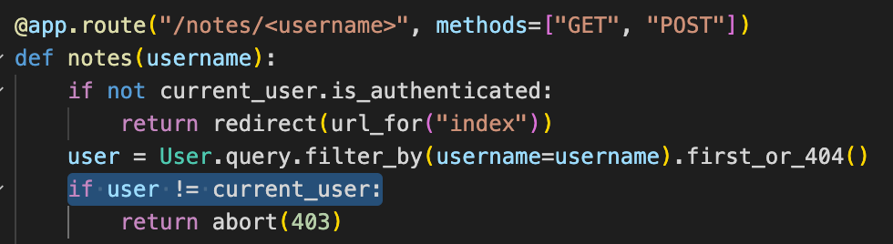
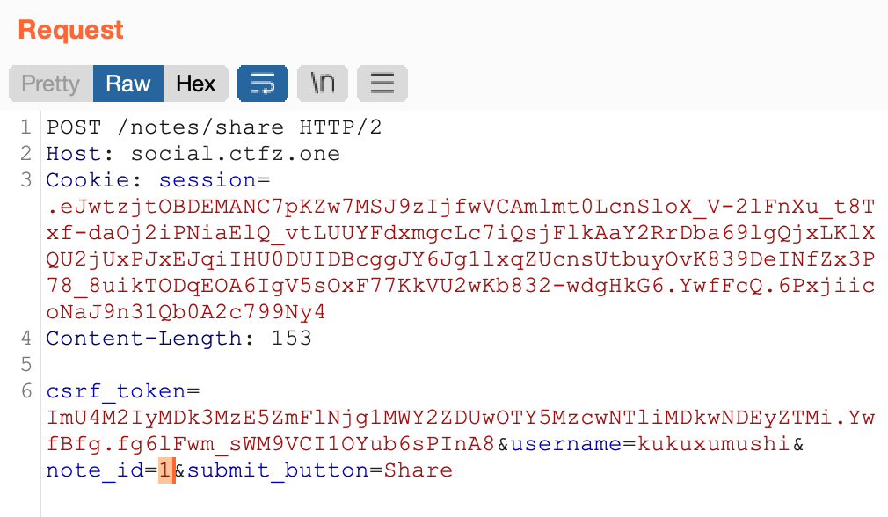

Easy Web task called Social Notes 

Description:
“Finally we developed soy eco free gluten free open-source mvc flask web-app made with popular flask modules and soy coffee. Now you can share you ideas with your social space.”

That's what we see when we opened the link:

Register and sign-in pages have similar functionality:

Lets try to register.
On the main page we can see simple web site, where we can create and share notes.

What could go wrong with such an ordinary service?

Fortunately, we have access to the source code of the application, from which we understood the purpose of the task - to read the notes of a given user (ctfzone_admin).

If we look at the code responsible for displaying the notes page, we will see that everything is safe here, and we will not be able to bypass the checks.

But luckily for us, the developer decided only to check the username itself when sharing notes.

Now we just need to figure out how to register a user with the same name as the target user.

If we look at the source code of the registration function, we see that we will not be able to register the same username through the sign-up form.

But when we look at the oAuth flow, we can see there is nothing that stops us from registering with the existing username.

To sum up, in order to get the flag we need to do the following:

1) Register a normal user, who will catch the notes.
2) Register an account on one of the 4 oauth providers (discord, reddit, github and gitlab) with the same name as the user with the flag.
4) Register to the website using one of the 4 oAuth providers.
5) Make several requests to share notes from the ctfzone_admin with our normal user.
6) Log in to normal user account an read the flag.

The process of “hacking”:

1) We already did this step while exploring the application.
2) To create an account with a popular username I chose discord because I was sure that I can create a nonunique name there. 

3) We perform the necessary steps to register via oAuth provider.

Aaaaaaand we are in!

But as we saw in the code we cannot just read his notes

4) After getting “username=ctfzone_admin” in our session object, we can share his private notes to our normal account.

5) And then, when we log in to our normal user account we can see shared notes from cfzone_admin.

Conclusions:
Do not allow linking oAuth accounts to existing users based on username or email without additional confirmation.
Do not rely on nonunique fields (like username) when retrieving user secrets from the database.
